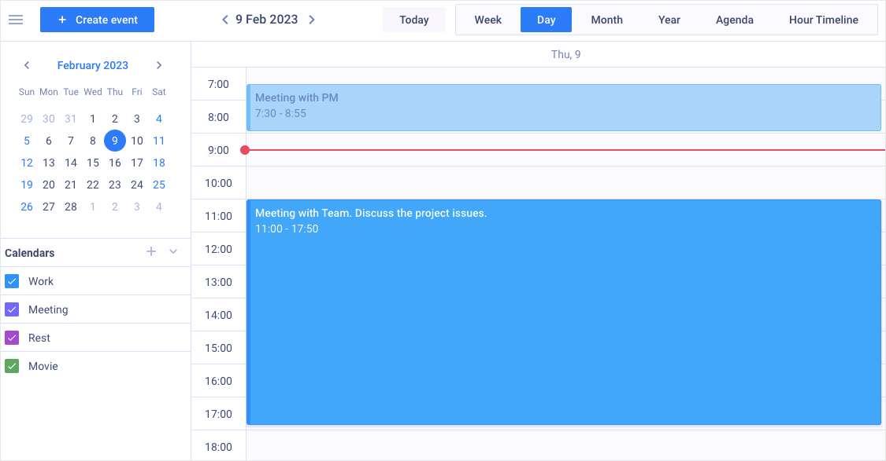
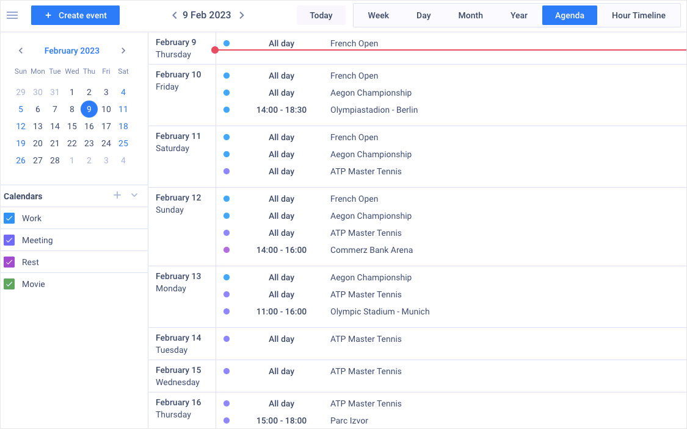
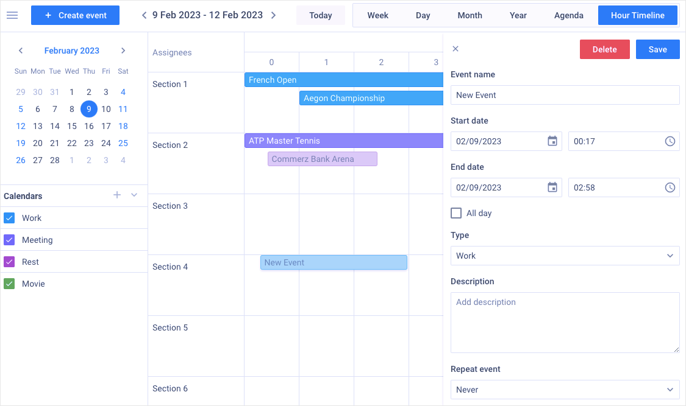
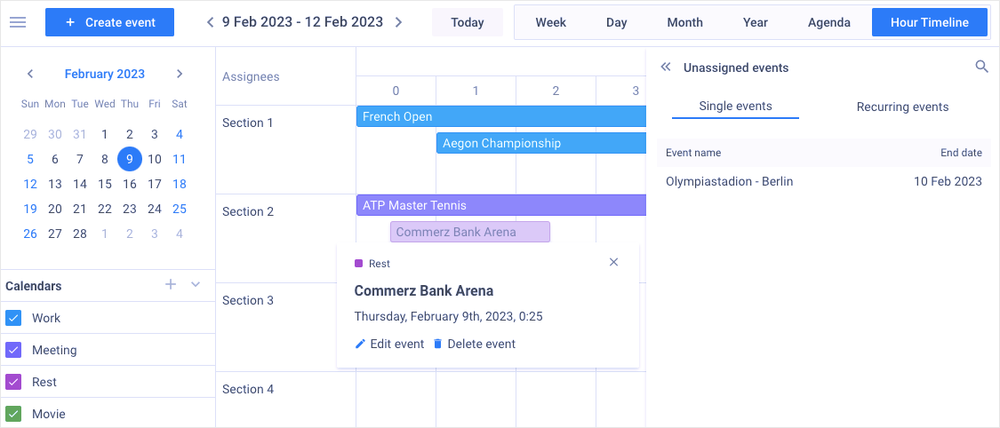

# DHTMLX Event Calendar overview

JavaScript **Event Calendar** is a modern web tool for efficient time-management and scheduling events. It perfectly works on both desktop and mobile platforms. This solution will help you to manage your schedule as well as plane new appointments by adding as much events as you need. It is also easy to reschedule all the events using drag-n-drop. The appropriate display modes will help to look through the events scheduled for a day, week, month, year and agenda.

## Event Calendar structure

### Toolbar

The **Toolbar** is the top part of Event Calendar. It consists of the controls for managing the widget functionality. Here you can perform the following operations:

- view the events throught the **Day**, **Week**, **Month**, **Year** and **Agenda** view modes using the corresponding controls
- go to the current date using a **Today** button
- switch to the needed date using the special arrows in the middle part of Toolbar
- create new events, using a **+ Create event** button
- hide/show a sidebar using a "humburger" icon

### Sidebar

The **Sidebar** is a modal part of Event Calendar located on the left. It includes a compact *datepicker* for picking dates and special controls for managing the predefined calendars. You can show/hide the sidebar using a "humburger" icon on the left part of Toolbar or manage it via API. Read more in the [Configuration](./guides/configuration/#sidebar) section.

The Sidebar controls allow performing the following operations:

- pick the desired date using the compact datepicker
- hide/show events related to the predefined or custom calendars

### Timetable grid

The **Timetable grid** is the main part of Event Calendar. It consists of the ***events*** distributed into the corresponding *cells* (or *rows*). Depending on the display mode, the grid may include the vertical and horizontal timescales. You can flexibly configure the grid appearance to meet your project needs. Read more in the [Configuration](./guides/configuration/#timetable-grid) section.

On the **Timetable grid** you can work with ***events*** in the following way:

- add new events by clicking on the empty space and dragging the cursor down
- show an info popup window by clicking on the event
- open an editor by double clicking on the event
- reschedule events by dragging them to the desired place (calendar cell/date) 
- reschedule events by resizing them

### Editor

The **Editor** is a modal part of Event Calendar located on the right. It consists of the fields and controls for managing data of the selected event. To display the editor, double click on the event you want to modify or click on the "Edit event" button in the popup window. You can flexibly configure the editor structure by adding new fields and controls. Read more in the [Configuration](./guides/configuration#editor) section.

### Popup window

The **Popup window** is a modal part of Event Calendar that displays the event data. To show the popup, click on the event the data of which you want to look through. You can flexibly customize the popup appearance by adding new fields. Read more in the [Customization](./guides/customization/#custom-events-popups-and-timescale-header) section.

## What's next

Now you can get down to using Event Calendar in your application. Follow the directions of the [How to start](./how_to_start) tutorial for guidance.